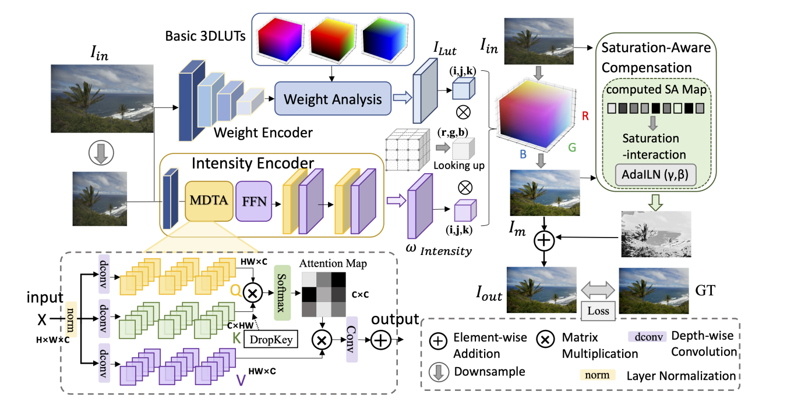

Pixel-Learnable 3DLUT with Saturation-Aware Compensation for Image Enhancement

## Abstract

Abstract—The 3D Lookup Table (3DLUT)-based methods are gaining popularity due to their satisfactory and stable performance in achieving automatic and adaptive real time image enhancement. In this paper, we present a new solution to the intractability in handling continuous color transformations of 3DLUT due to the lookup via three independent color channel coordinates in RGB space. Inspired by the inherent merits of the HSV color space, we separately enhance image intensity and color composition. The Transformer-based Pixel-Learnable 3D Lookup Table is proposed to undermine contouring artifacts,which enhances images in a pixel-wise manner with non-local information to emphasize the diverse spatially variant context. In addition, noticing the underestimation of composition color component, we develop the Saturation-Aware Compensation (SAC) module to enhance the under-saturated region determined by an adaptive SA map with Saturation-Interaction block, achieving well balance between preserving details and color rendition.Our approach can be applied to image retouching and tone mapping tasks with fairly good generality, especially in restoring localized regions with weak visibility. The performance in both theoretical analysis and comparative experiments manifests that the proposed solution is effective and robust.

## Method 



Fig. 1. Illustration of the proposed Network. We first send the resized low-resolution portrait input image to the two starting points, corresponding to the dual-branches, namely Weight Analysis branch(upper) and Intensity Encoder branch(lower). Afterwards, we perform pixel-wise multiplication between the obtained 3DLUT enhanced image ILut and the Intensity Weight map ωIntensity for the initial enhanced images Im. Next, the Im and input Iin are sent to the Saturation-Aware Compensation module, which elaborately estimate the difference in saturation values as the guide to generate SA map for adaptative
saturation and contrast transform. Finally we add Im and SA map together to gain the high-quality Iout.

## Data Preparation

PPR10K Dateset：

Download raw portrait photos and retouching target from [baiduyun](https://pan.baidu.com/s/1FMNZ6QTII6dkwj4YY_faYA) (code:pprd).

MIT-Adobe FiveK Dataset：

Download raw portrait photos and retouching target from [baiduyun](https://pan.baidu.com/s/12FwCfEWKrJ7FMkPdqW47Mg) (code:fv5k).

HDR+ Dateset：

Download raw portrait photos and retouching target from [baiduyun](https://pan.baidu.com/s/1fV2uwrZLy9KE1BNnkl0XzQ) (code:hdrp).
~~~~
Please ensure the data structure is as below

├── ppr
   ├── train
       ├── source_aug
           ├── 0_0.tif
           ├── 0_0_1.tif
           └── ...
       ├── target
           ├── 0_0.tif
           ├── 0_1.tif
           └── ...
   └── val
       ├── source
           ├── 1356_0.tif
           ├── 1356_1.tif
           └── ...
       ├── target
           ├── 1356_0.tif
           ├── 1356_1.tif
           └── ...
           
├── FiveK
   ├── train_input
           ├── 1_0.tif
           └── ...
   ├── train_target
           ├── 1_0.tif
           └── ...
   ├── test_input
           ├── 4501_0.tif
           └── ...
   ├── test_target
           ├── 4501_0.tif
           └── ...
           
└── hdr
   ├── train_input
           ├── 193_0.tif
           └── ...
   ├── train_target
           ├── 193_0.tif
           └── ...
   ├── test_input
           ├── 196_0.tif
           └── ...
   ├── test_target
           ├── 196_0.tif
           └── ...
~~~~
##Environment Preparation
Requirements
```
pip install -r requirements.txt
conda install pytorch=1.8 torchvision cudatoolkit=10.2 -c pytorch
pip install matplotlib scikit-learn scikit-image opencv-python yacs joblib natsort h5py tqdm
pip install einops gdown addict future lmdb numpy pyyaml requests scipy tb-nightly yapf lpips
```


Build. Modify the CUDA path in trilinear_cpp/setup.sh adaptively and
```
cd trilinear
sh trilinear/setup.sh
```

## Training

To train our method on the dataset, please run this command:
```train
python train.py --data_path [path_to_dataset] --gpu_id [gpu_id] --output_dir [path_to_save_models]
```


## Evaluation

To evaluate our model on the dataset, run:

Generate the retouched results:
```eval
python validation.py --data_path [path_to_dataset] --gpu_id [gpu_id] --model_dir [path_to_models]
```

## Citation

```bibtex
@article{Liu2021PixelLearnable3DLUT,
  title={Pixel-Learnable 3DLUT with Saturation-Aware Compensation for Image Enhancement},
  author={Jing Liu and Qingying Li and Xiongkuo Min and Yuting Su and Guangtao Zhai and Xiaokang Yang},
  journal={IEEE Journal of LaTeX Class Files},
  volume={14},
  number={8},
  year={2021},
  month={August}
}


